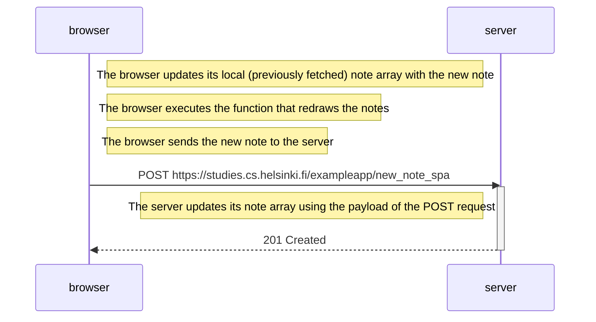

```mermaid
sequenceDiagram
    participant browser
    participant server

    Note right of browser: The browser updates its local (previously fetched) note array with the new note
    Note right of browser: The browser executes the function that redraws the notes
    Note right of browser: The browser sends the new note to the server 
    browser->>server: POST https://studies.cs.helsinki.fi/exampleapp/new_note_spa
    activate server
    Note left of server: The server updates its note array using the payload of the  POST request
    server-->>browser: 201 Created 
    deactivate server
```
